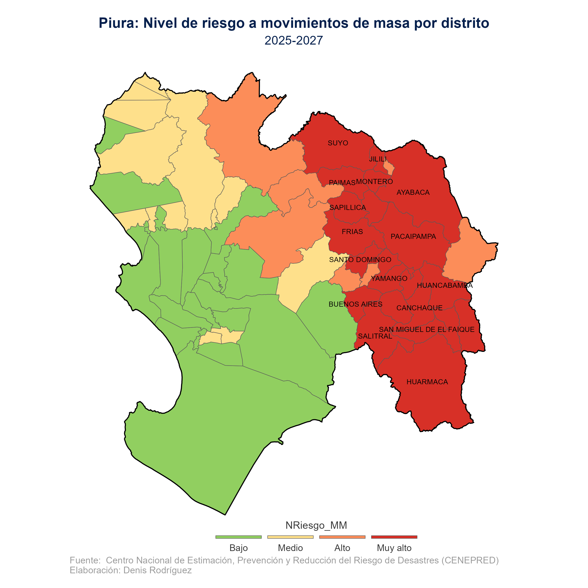

Los eventos climáticos extremos asociados a El Niño y La Niña incrementan el riesgo de inundaciones y movimientos de masa en diversas regiones del país. En este contexto, resulta fundamental contar con herramientas que permitan identificar los territorios más expuestos y apoyar la toma de decisiones basada en evidencia.

En este artículo se presenta la elaboración de un mapa profesional del nivel de riesgo a movimientos de masa a nivel distrital en el departamento de Piura, utilizando R y datos oficiales de [**CENEPRED**](https://sigrid.cenepred.gob.pe/sigridv3/documento/17791). El análisis permite identificar los distritos expuestos a un nivel Muy Alto de riesgo y aporta una visualización clara para la gestión y prevención del riesgo.

> 📌 El objetivo final será **identificar visualmente en qué zonas de Piura se concentra el mayor nivel de riesgo**.

### 1. Librerías necesarias

``` r
library(tidyverse)
library(sf)
library(leaflet)
```

### 2. Descarga automática de los datos

Los datos corresponden al **Escenario Climático -- Riesgo a Movimientos de Masa** a nivel distrital.

``` r
url_zip <- "https://sigrid.cenepred.gob.pe/sigridv3/storage/escenario_climatico_llu/10_shape.zip"

if (!file.exists("data/10_shape.zip")) {
  download.file(url_zip, "data/10_shape.zip", mode = "wb")
}

dir.create("data/shapefiles", showWarnings = FALSE)
unzip("data/10_shape.zip", exdir = "data/shapefiles")
```

### 3. Lectura del shapefile de riesgo

``` r
shp_masa <- st_read("data/shapefiles/Shape/Riesgo_MMasa_Distritos.shp")
```

Variables clave:

-   `NOMBDEP`: Departamento
-   `NOMBPROV`: Provincia
-   `NOMBDIST`: Distrito
-   `NRiesgo_MM`: Nivel de riesgo

### 4. Filtrar únicamente el departamento de Piura

``` r
shp_masa_piura <- shp_masa |>
  filter(str_to_title(str_to_lower(NOMBDEP)) == "Piura")
```

Este paso es fundamental para **enfocar el análisis territorial** solo en Piura.

### 5. Ordenar niveles de riesgo y definir colores

``` r
shp_masa_piura$NRiesgo_MM <- factor(
  shp_masa_piura$NRiesgo_MM,
  levels = c("Muy alto", "Alto", "Medio", "Bajo")
)

colores_categorias <- c(
  "Muy alto" = "#D73027",
  "Alto"     = "#FC8D59",
  "Medio"    = "#FEE08B",
  "Bajo"     = "#91CF60"
)
```

🔴 Los colores más intensos representan **mayor nivel de riesgo**.

### 6. Construcción del mapa estático

``` r
piu_map <- ggplot(shp_masa_piura) +
  geom_sf(aes(fill = NRiesgo_MM)) +
  scale_fill_manual(values = colores_categorias) +
  labs(
    title = "Piura: Nivel de riesgo a movimientos de masa por distrito",
    subtitle = "Periodo 2025–2027",
    caption = "Fuente: CENEPRED | Elaboración: Denis Rodríguez"
  )
```

### 7. Etiquetar distritos con riesgo Muy Alto

``` r
cents_m <- shp_masa_piura |>
  st_point_on_surface() |>
  st_coordinates() |>
  as.data.frame() |>
  bind_cols(st_drop_geometry(shp_masa_piura))

piu_map <- piu_map +
  geom_text(
    data = cents_m |> filter(NRiesgo_MM == "Muy alto"),
    aes(X, Y, label = NOMBDIST),
    size = 2.5,
    color = "black",
    check_overlap = TRUE
  )
```

Esto permite **identificar claramente los distritos más críticos**.

### 8. Ajuste visual final

``` r
piu_map <- piu_map +
  theme_minimal() +
  theme(
    axis.text = element_blank(),
    axis.ticks = element_blank(),
    panel.grid = element_blank(),
    legend.position = "bottom"
  )
```

### 9. Exportar el mapa

``` r
ggsave(
  "imagenes/Map_Piura_masa.png",
  piu_map,
  width = 8,
  height = 8,
  dpi = 320
)
```



Ideal para **informes institucionales y presentaciones**.

## 11. ¿En qué zonas de Piura se observa mayor riesgo?

El análisis visual del mapa muestra que el **riesgo Muy Alto y Alto** se concentra principalmente en:

-   Distritos de la **sierra de Piura**
-   Zonas con **pendientes pronunciadas**
-   Áreas con mayor exposición a **lluvias intensas**

Estos territorios requieren **priorización en la planificación preventiva**, gestión del riesgo y toma de decisiones públicas.

## 12. Conclusión

Este ejercicio demuestra cómo:

-   Pasar de datos espaciales oficiales a **mapas claros y comunicables**
-   Combinar **mapas estáticos** para informes y **mapas interactivos** para exploración
-   Identificar **territorios críticos** en Piura con evidencia visual

📊 **El mapa no solo comunica datos, comunica riesgo.**
