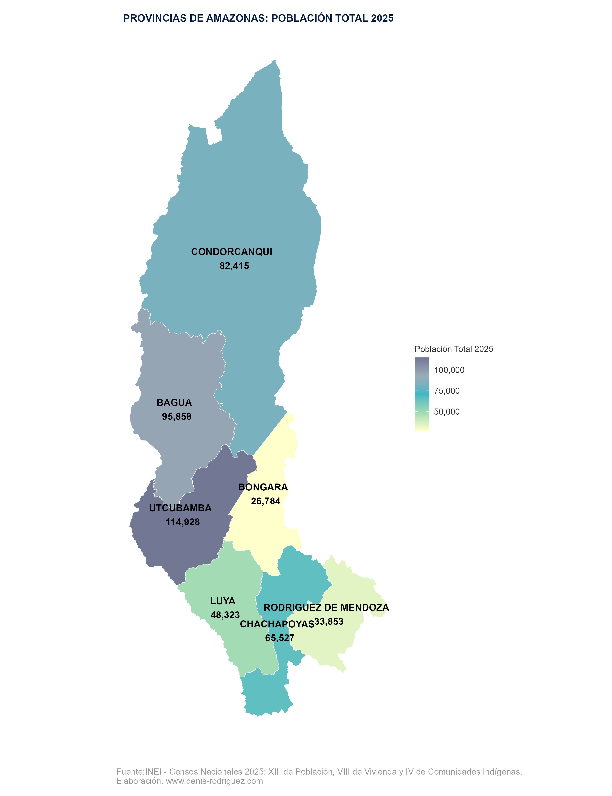

## INTRODUCCIÓN

Cada **11 de julio** se conmemora el **Día Mundial de la Población**, una fecha promovida por las Naciones Unidas para reflexionar sobre las tendencias demográficas y la importancia de contar con información estadística de calidad para el diseño de políticas públicas.

En este contexto, el **Instituto Nacional de Estadística e Informática (INEI)** publicó recientemente los resultados del **XIII Censo de Población, VIII de Vivienda y IV de Comunidades Indígenas (2025)**, proporcionando información actualizada sobre la población peruana a diferentes niveles territoriales.

Los mapas constituyen una de las mejores herramientas para comunicar este tipo de información. En pocos segundos permiten identificar patrones espaciales que, en una tabla de datos, podrían pasar desapercibidos.

En este tutorial aprenderás a construir un **mapa coroplético de la población provincial** utilizando en **R**, empleando los datos oficiales del Censo Nacional 2025. El mismo código puede reutilizarse para cualquiera de las **25 regiones del Perú**, modificando únicamente el nombre del departamento.

Al finalizar tendrás un mapa similar al siguiente:

- Cada provincia estará coloreada según su población.
- El color plomo indica una mayo concentración de Población
- Las etiquetas mostrarán el nombre de la provincia y su población total.
- El mapa estará listo para publicarse en redes sociales o incorporarse en un informe técnico o en presentaciones.
#### POBLACIÓN DE LAS PROVINCIAS DE AMAZONAS


El mapa permite identificar rápidamente que Utcubamba y Bagua concentran la mayor población del departamento de Amazonas, con más de 90 mil habitantes.

<details>
<summary><strong>Áncash</strong></summary>

#### POBLACIÓN DE LAS PROVINCIAS DE ÁNCASH


</details>

<details>
<summary><strong>Apurímac</strong></summary>

#### POBLACIÓN DE LAS PROVINCIAS DE APURÍMAC


</details>

<details>
<summary><strong>Arequipa</strong></summary>

#### POBLACIÓN DE LAS PROVINCIAS DE AREQUIPA


</details>

<details>
<summary><strong>Ayacucho</strong></summary>

#### POBLACIÓN DE LAS PROVINCIAS DE AYACUCHO


</details>

<details>
<summary><strong>Cajamarca</strong></summary>

#### POBLACIÓN DE LAS PROVINCIAS DE CAJAMARCA


</details>

<details>
<summary><strong>Callao</strong></summary>

#### POBLACIÓN DE LA REGIÓN CALLAO


</details>

<details>
<summary><strong>Cusco</strong></summary>

#### POBLACIÓN DE LAS PROVINCIAS DE CUSCO


</details>

<details>
<summary><strong>Huancavelica</strong></summary>

#### POBLACIÓN DE LAS PROVINCIAS DE HUANCAVELICA


</details>

<details>
<summary><strong>Huánuco</strong></summary>

#### POBLACIÓN DE LAS PROVINCIAS DE HUÁNUCO


</details>

<details>
<summary><strong>Ica</strong></summary>

#### POBLACIÓN DE LAS PROVINCIAS DE ICA


</details>

<details>
<summary><strong>Junín</strong></summary>

#### POBLACIÓN DE LAS PROVINCIAS DE JUNÍN


</details>

<details>
<summary><strong>La Libertad</strong></summary>

#### POBLACIÓN DE LAS PROVINCIAS DE LA LIBERTAD


</details>

<details>
<summary><strong>Lambayeque</strong></summary>

#### POBLACIÓN DE LAS PROVINCIAS DE LAMBAYEQUE


</details>

<details>
<summary><strong>Lima Metropolitana</strong></summary>

#### POBLACIÓN DE LIMA METROPOLITANA


</details>

<details>
<summary><strong>Loreto</strong></summary>

#### POBLACIÓN DE LAS PROVINCIAS DE LORETO


</details>

<details>
<summary><strong>Madre de Dios</strong></summary>

#### POBLACIÓN DE LAS PROVINCIAS DE MADRE DE DIOS


</details>

<details>
<summary><strong>Moquegua</strong></summary>

#### POBLACIÓN DE LAS PROVINCIAS DE MOQUEGUA


</details>

<details>
<summary><strong>Pasco</strong></summary>

#### POBLACIÓN DE LAS PROVINCIAS DE PASCO


</details>

<details>
<summary><strong>Piura</strong></summary>

#### POBLACIÓN DE LAS PROVINCIAS DE PIURA


</details>

<details>
<summary><strong>Puno</strong></summary>

#### POBLACIÓN DE LAS PROVINCIAS DE PUNO


</details>

<details>
<summary><strong>Región Lima</strong></summary>

#### POBLACIÓN DE LAS PROVINCIAS DE LA REGIÓN LIMA


</details>

<details>
<summary><strong>San Martín</strong></summary>

#### POBLACIÓN DE LAS PROVINCIAS DE SAN MARTÍN


</details>

<details>
<summary><strong>Tacna</strong></summary>

#### POBLACIÓN DE LAS PROVINCIAS DE TACNA


</details>

<details>
<summary><strong>Tumbes</strong></summary>

#### POBLACIÓN DE LAS PROVINCIAS DE TUMBES


</details>

<details>
<summary><strong>Ucayali</strong></summary>

#### POBLACIÓN DE LAS PROVINCIAS DE UCAYALI


</details>

##  COSTRUIR LOS MAPAS
### Datos utilizados

Para este ejercicio se emplean dos fuentes de información:

- El **[shapefile de provincias del Perú](https://github.com/Denis-Yen/Blog/tree/main/DiaMundialPoblacion2025/data/SHP%20PERU/PROVINCIAS)**, que contiene la geometría oficial de cada provincia.
- La base de datos de población, estructurada con el ubigeo provincial, publicada por el INEI: [📥 Descargar base de datos](https://raw.githubusercontent.com/Denis-Yen/Blog/main/DiaMundialPoblacion2025/data/Poblaci%C3%B3n_Proyectada_2025_cpv.xlsx)

Posteriormente ambas fuentes se integran mediante el código único de provincia (`IDPROV`) que es el ubigeo provincial.

#### **Descarga todos los mapas [aquí](https://github.com/Denis-Yen/Blog/tree/main/DiaMundialPoblacion2025/imagenes/CPV_2025).**

---

### 1. Cargar las librerías

Comenzamos cargando las librerías necesarias.

```r
library(tidyverse)
library(openxlsx)
library(viridis)
library(sf)
library(ggspatial)
library(ggrepel)
library(grid, quietly = TRUE)
library(gridExtra, quietly = TRUE)
library(giscoR, quietly = TRUE)
library(classInt, quietly = TRUE)
library(sp)
library(extrafont)
library(rcartocolor)
library(scales)
```

---

### 2. Leer la cartografía y la base de datos

Cargamos el shapefile de provincias y la tabla con la población del Censo Nacional 2025.

```r
shp_provincias <- st_read(
  "Data/SHP PERU/PROVINCIAS/PROVINCIAS_inei_geogpsperu_suyopomalia.shp"
)

poblacion25 <- read.xlsx(
  "data/Población_Proyectada_2025_cpv.xlsx"
)
```

---

### 3. Uniendo la información

Ahora unimos ambas fuentes mediante el identificador de provincia `IDPROV`.

```r
shp_provincia_pob_cpv <-
  shp_provincias %>%
  left_join(
    poblacion25,
    by = c("IDPROV" = "ID_PROV")
  )
```

El nuevo objeto espacial contiene tanto la geometría como la población provincial total registrada en el Censo Nacional 2025.

---

### 4. Definir una paleta de colores

Para representar la población utilizaremos una escala continua personalizada.
El color gris indica una mayor conetración de población.

```r
colores_personalizados <- c(
  "#ffffcc",
  "#a1dab4",
  "#41b6c4",
  "#9aacb8",
  "#727794"
)
```

Puedes modificar esta paleta por cualquier otra que se adapte a la identidad visual de tu proyecto.

---

### 5. Construir el mapa

En este ejemplo elaboraremos el mapa para el departamento de **Amazonas**.

```r
shp_provincia_pob_cpv |>
  filter(NOMBDEP == "AMAZONAS") |>
  ggplot() +

  geom_sf(
    aes(fill = POBLACION.TOTAL.2025),
    color = "white",
    size = .3
  ) +

  scale_fill_gradientn(
    name = "Población Total 2025",
    colors = colores_personalizados,
    labels = label_comma()
  ) +

  geom_sf_text(
    aes(
      label = paste(
        NOMBPROV,
        "\n",
        comma(POBLACION.TOTAL.2025)
      )
    ),
    size = 4,
    color = "black",
    fontface = "bold",
    check_overlap = FALSE
  ) +

  labs(
    title = "PROVINCIAS DE AMAZONAS: POBLACIÓN TOTAL 2025",
    caption = "Fuente: INEI - Censos Nacionales 2025\nElaboración: www.denis-rodriguez.com",
    x = ""
  ) +

  theme(
    panel.background = element_blank(),
    legend.background = element_blank(),
    panel.border = element_blank(),
    panel.grid.minor = element_blank(),
    panel.grid.major = element_blank(),

    plot.title = element_text(
      size = 12,
      colour = "#05204d",
      hjust = .5,
      face = "bold"
    ),

    plot.caption = element_text(
      size = 10,
      colour = "grey60"
    ),

    legend.text = element_text(size = 10),
    legend.title = element_text(size = 10),

    axis.title.y = element_blank(),
    axis.ticks = element_blank(),
    axis.text.x = element_blank(),
    axis.text.y = element_blank()
  )
```

El resultado será un mapa donde el color representa la población provincial y las etiquetas muestran el nombre de cada provincia junto con su población.

---

### 6. Exportar el mapa

Para guardar el resultado en alta resolución utilizamos `ggsave()`.

```r
ggsave(
  "imagenes/CPV_2025/amazonas.png",
  width = 10,
  height = 13,
  dpi = 320,
  units = "in"
)
```

Estas dimensiones producen una imagen con excelente calidad para publicaciones impresas y redes sociales.

---

### 7. ¿Cómo generar el mapa de cualquier región?

Una de las ventajas de este flujo de trabajo es que **el código es completamente reutilizable**.

Solo debes modificar el filtro correspondiente al departamento.

Por ejemplo:

```r
filter(NOMBDEP == "CUSCO")
```

```r
filter(NOMBDEP == "PIURA")
```

El resto del código permanece exactamente igual.

---

### 8. Personaliza el tamaño de exportación

Cada departamento posee una forma distinta.

Por ello, puedes modificar las dimensiones del archivo exportado según tus necesidades.

| Formato | Resolución |
|----------|-----------:|
| Instagram (4:5) | 1080 × 1350 px |
| Cuadrado | 1080 × 1080 px |
| Stories | 1080 × 1920 px |

---

### Conclusión

Los datos abiertos del **Censo Nacional 2025** constituyen una valiosa fuente de información para analizar la distribución  de la población a nivel provincial.

Con unas pocas líneas de código en **R** es posible construir mapas temáticos claros, reproducibles y listos para ser utilizados en investigaciones, informes o publicaciones digitales o presetaciones.

Este mismo procedimiento puede emplearse para generar mapas de cualquiera de las **25 regiones del Perú**, facilitando la elaboración de atlas estadísticos o visualizaciones para redes sociales.

Espero que este tutorial sea de utilidad para investigadores, estudiantes, periodistas de datos y cualquier persona interesada en la cartografía temática y la visualización de datos con **R**.

---

### Fuente de datos

**Instituto Nacional de Estadística e Informática (INEI).**

**XIII Censo de Población, VIII de Vivienda y IV de Comunidades Indígenas (2025).**

https://censos2025.inei.gob.pe/resultados/poblacion-total/comparativo-territorial

----

<div style="text-align:center; margin: 2rem 0;">
  <a href="https://www.buymeacoffee.com/denisyenrc7">
    
  </a>
</div>

<div style="text-align:center; color:#6fc7da; font-weight:600;">
Si este contenido te fue útil,
</div>
<div style="text-align:center; color:#6fc7da;">
puedes apoyarme con un café ☕.  
Es una forma sencilla de ayudarme a seguir creando y compartiendo conocimiento.
</div>


