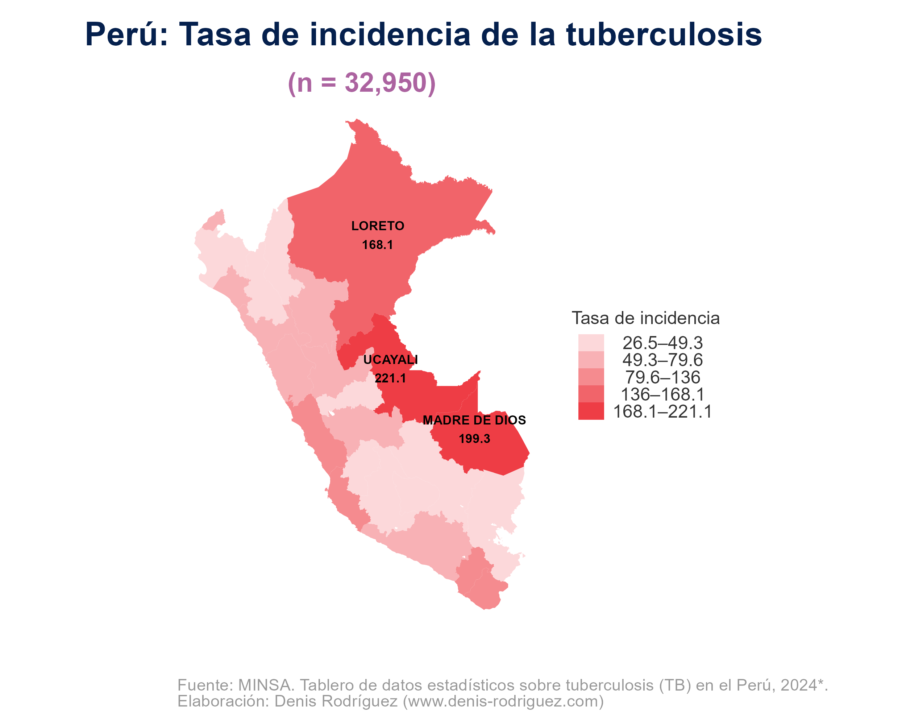

## Tuberculosis en el Perú: una mirada desde el territorio

La tuberculosis continúa siendo un problema de salud pública en el Perú. El país ha tenido avances importantes en su control; sin embargo, analizar su distribución territorial permite identificar patrones espaciales y orientar mejor las intervenciones.

Este análisis utiliza información preliminar proveniente del MINSA:

**Fuente: MINSA. Tablero de datos estadísticos sobre tuberculosis (TB) en el Perú, 2024*.**  
https://www.tuberculosis.minsa.gob.pe/DashboardDPCTB/SalaSituacionalList.aspx  

La base de datos se encuentra disponible en formato PDF, lo que dificulta su procesamiento y análisis. Para este ejercicio, se utilizó Power Query con el fin de estructurar la información en una base de datos en Excel, permitiendo su posterior análisis y la elaboración de mapas de distribución.

---

## ¿Qué estamos midiendo?

En la base de datos se cuenta con los siguientes indicadores:

- **Morbilidad**: cantidad total de casos  
- **Incidencia A**: Casos nuevos + recaídas de TB.
- **Incidencia B**: Casos nuevos + recaídas de TB pulmonar con confirmación bacteriológica. 

Para este análisis se utiliza la **Incidencia A**, la cual se denomina como **tasa de incidencia de la tuberculosis**, al representar de manera más amplia la carga de la enfermedad.

---

## Tasa de incidencia de la tuberculosis

La tasa de incidencia se calcula de la siguiente manera:

$$
Tasa\ de\ incidencia = \left( \frac{Casos\ nuevos\ +\ recaídas}{Población} \right) \times 100,000
$$

Este indicador permite comparar territorios con distintos tamaños de población y entender dónde la enfermedad tiene mayor presencia relativa.

---

## Principales hallazgos

El análisis territorial evidencia patrones claros en la distribución de la tuberculosis en el Perú.

En primer lugar, las **regiones de la selva** presentan las mayores tasas de incidencia. Este resultado refleja condiciones estructurales asociadas a acceso a servicios de salud, dispersión territorial y determinantes sociales que influyen en la transmisión de la enfermedad.

En segundo lugar, **Lima Metropolitana** también muestra niveles elevados de incidencia. Esto puede explicarse por la alta densidad poblacional, la concentración urbana y la presencia de contextos de vulnerabilidad que facilitan la propagación de la tuberculosis.

Este patrón territorial no es aislado. Al analizar la información a nivel de provincias, se observa que la distribución se mantiene, lo que evidencia una persistencia espacial del problema y refuerza la necesidad de intervenciones focalizadas.

---

## Consideraciones sobre el análisis territorial

Si bien el análisis a nivel departamental permite identificar tendencias generales, es importante considerar algunas limitaciones al profundizar en niveles más desagregados.

En el caso del nivel distrital, existen territorios con **poblaciones pequeñas**, lo que puede generar tasas de incidencia elevadas debido a efectos estadísticos del denominador. En estos casos, la tasa por cada 100 mil habitantes puede sobredimensionar la magnitud del problema.

Por ello, los resultados a nivel distrital deben interpretarse con cautela y siempre complementarse con otras variables, como el tamaño poblacional y el contexto territorial.

---

## Reflexión final

La tuberculosis en el Perú presenta una **distribución territorial desigual**, concentrándose principalmente en las regiones de la selva y en Lima Metropolitana.

Este tipo de análisis permite identificar territorios prioritarios y fortalecer la toma de decisiones. Asimismo, resalta la importancia de contar con sistemas de información robustos que permitan monitorear la evolución de la enfermedad en distintos niveles territoriales.

Comprender dónde y cómo se distribuye la tuberculosis es un paso clave para diseñar políticas públicas más efectivas y orientadas a reducir las brechas en salud.

### Aprende Hacerlo en R con Positron

- Un mapa coroplético por departamentos.  
- Un mapa coroplético por provincias.  
- Un mapa coroplético por distritos.  

## Descargar y leer los datos

El archivo se encuentra alojado en el repositorio de  GitHub.  
Antes tienes que instalar [Positron](https://positron.posit.co/download.html) el nuevo IDE para R.

Descarga el el proyecto [aquí](https://github.com/Denis-Yen/Blog/tree/main/Tuberculosis)

----

  

Si este contenido te fue útil,

puedes apoyarme con un café ☕.  
Es una forma sencilla de ayudarme a seguir creando y compartiendo conocimiento.

